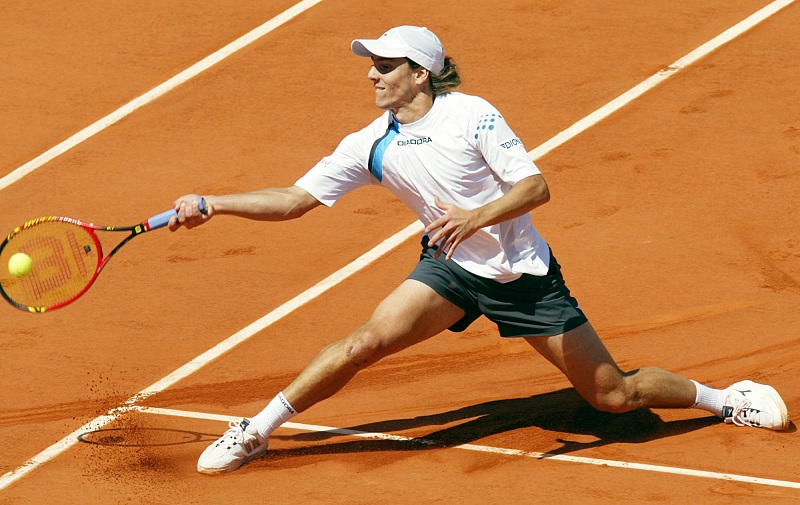
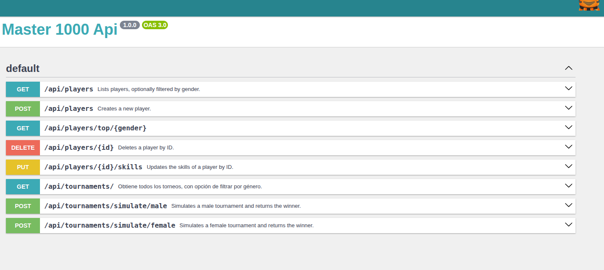

# Proyecto de Simulación de Torneos de Tenis Master1000Geo :)

Este proyecto es una API en Symfony que permite simular torneos deportivos masculinos y femeninos, gestionando jugadores, partidos y resultados.



## Tabla de Contenidos

1.  [Requisitos del Sistema](#requisitos-del-sistema)
2.  [Instalación](#instalación)
3.  [Configuración](#configuración)
4.  [Ejecución de la Aplicación](#ejecución-de-la-aplicación)
5.  [Ejecución de Migraciones de Doctrine](#ejecución-de-migraciones-de-doctrine)
6.  [Carga de Datos de Prueba (Jugadores)](#carga-de-datos-de-prueba-jugadores)
7.  [Endpoints de la API](#endpoints-de-la-api)
8.  [Uso de Swagger UI](#uso-de-swagger-ui)
9.  [Pruebas](#pruebas)
10. [Lógica Adicional](#lógica-adicional)
11. [Contribución (Opcional)](#contribución-opcional)
12. [Notas Adicionales](#notas-adicionales)

## 1. Requisitos del Sistema

* PHP >= 8.1
* Composer
* Docker y Docker Compose

## 2. Instalación

1.  Clona el repositorio del proyecto:

    ```bash
    git clone <repositorio>
    cd <nombre_del_proyecto>
    ```

2.  Construye y levanta los contenedores Docker:

    ```bash
    docker compose up -d --build
    ```

3.  Instala las dependencias de Composer dentro del contenedor PHP:

    ```bash
    docker compose exec app composer install
    ```

## 3. Configuración

La configuración se maneja principalmente a través del archivo `docker-compose.yml` y las variables de entorno definidas allí.

## 4. Ejecución de la Aplicación

La aplicación estará disponible en `http://localhost:8080` (o la URL que hayas configurado en el `compose.yml`).

## 5. Ejecución de Migraciones de Doctrine

```bash
docker compose exec app php bin/console doctrine:migrations:migrate -n
```
Este comando aplicará cualquier migración pendiente a la base de datos, creando las tablas necesarias.

## 6. Carga de Datos de Prueba (Jugadores)
   Para cargar datos de prueba (20 jugadores) en la base de datos, puedes ejecutar el siguiente comando:

```bash
docker compose exec app php bin/console doctrine:fixtures:load
```

## 7. Endpoints de la API

* `GET /api/players`: Obtiene todos los jugadores, con opción de filtrar, ordenar y limitar.
    * Parámetros de consulta opcionales:
        * `gender` (`male` o `female`) - Filtra por género.
        * `orderBy` (nombre de la propiedad, ej: `name`, `ability`) - Ordena por esta propiedad.
        * `orderDirection` (`asc` o `desc`) - Dirección de la ordenación.
        * `limit` (entero) - Limita el número de resultados.
    * Respuesta (JSON): Un array de objetos jugador.
* `POST /api/players`: Crea un nuevo jugador.
    * Request Body (JSON): Debe contener los datos del jugador (nombre, género, habilidades, edad).
    * Respuesta (JSON): El objeto del jugador recién creado.
* `GET /api/players/top/{gender}`: Obtiene los jugadores mejor rankeados por género.
    * Parámetro de ruta: `gender` (`male` o `female`).
    * Respuesta (JSON): Un array de objetos jugador ordenados por puntos.
* `DELETE /api/players/{id}`: Elimina un jugador por su ID.
    * Parámetro de ruta: `id` (el ID del jugador a eliminar).
    * Respuesta (JSON): Un mensaje de éxito o un error si el jugador no se encuentra.
* `PUT /api/players/{id}/skills`: Actualiza las habilidades de un jugador por su ID.
    * Parámetro de ruta: `id` (el ID del jugador a actualizar).
    * Request Body (JSON): Debe contener las habilidades a actualizar (strength, velocity, reaction, ability). Los campos no proporcionados no se modifican.
    * Respuesta (JSON): El objeto del jugador actualizado.
* `GET /api/tournaments/`: Obtiene todos los torneos, con opción de filtrar por género.
    * Parámetro de consulta opcional: `gender` (`male` o `female`).
    * Respuesta (JSON): Un array de objetos torneo, cada uno con su ID, nombre, fecha de inicio, fecha de fin, género e información del ganador (si existe).
* `POST /api/tournaments/simulate/male`: Simula un torneo masculino y devuelve el ganador.
    * Respuesta (JSON): Un mensaje de éxito y la información del ganador (objeto Player).
* `POST /api/tournaments/simulate/female`: Simula un torneo femenino y devuelve la ganadora.
    * Respuesta (JSON): Un mensaje de éxito y la información de la ganadora (objeto Player).




## 8. Uso de Swagger UI
   Para explorar y probar los endpoints de la API de forma interactiva, puedes utilizar Swagger UI. Está disponible en la ruta /api/doc de la aplicación: http://localhost:8080/api/doc.

## 9. Pruebas
   Si has implementado pruebas unitarias o funcionales, puedes ejecutarlas dentro del contenedor PHP:

```bash
docker compose exec app ./vendor/bin/phpunit
```


```
tests/
├── Player
│   ├── Application
│   │   ├── Command
│   │   │   ├── CreatePlayerCommandHandlerTest.php
│   │   │   ├── DeletePlayerCommandHandlerTest.php
│   │   │   └── UpdatePlayerSkillsCommandHandlerTest.php
│   │   ├── Query
│   │   │   └── ListPlayersQueryHandlerTest.php
│   │   └── Service
│   │       ├── FemalePlayerCreatorTest.php
│   │       └── MalePlayerCreatorTest.php
│   └── Domain
│       └── ValueObject
│           ├── AbilityTest.php
│           ├── GenderTest.php
│           ├── ReactionTest.php
│           ├── SkillValueObjectTest.php
│           ├── StrengthTest.php
│           └── VelocityTest.php
└── Tounament
    └── Application
        ├── Command
        │   └── SimulateTournamentCommandHandlerTest.php
        ├── Query
        │   └── GetTournamentsQueryHandlerTest.php
        └── Service
            ├── CheckDopingPlayersServiceTest.php
            ├── MatchWinnerServiceTest.php
            └── TournamentServiceTest.php
```

Este conjunto de pruebas unitarias busca asegurar la robustez y el correcto funcionamiento de la lógica de negocio en las diferentes capas de la aplicación. Se han implementado pruebas para:

* **Command Handlers:** Verificando la correcta ejecución de los comandos, incluyendo la creación, eliminación y actualización de jugadores, así como la simulación de torneos.
* **Query Handlers:** Asegurando la correcta recuperación de información, tanto de listas de jugadores como de detalles de los torneos.
* **Services:** Probando la lógica específica de los servicios, como la creación de jugadores basada en género, la verificación de doping, la determinación del ganador de los partidos y la gestión general de los torneos.
* **Value Objects:** Validando la correcta instanciación y las reglas de negocio de los objetos de valor del dominio, como las habilidades de los jugadores (fuerza, velocidad, reacción, habilidad), la edad y el género.


## 10. Lógica Adicional

* **Simulación de Torneos:** La simulación de torneos determina los ganadores de los partidos de la siguiente manera:
    * **Hombres:** Se consideran principalmente las habilidades de **fuerza (`strength`)** y **velocidad (`velocity`)** para determinar el ganador.
    * **Mujeres:** Se considera principalmente la habilidad de **reacción (`reaction`)** para determinar la ganadora.
      La habilidad general (`ability`) también influye en la probabilidad de victoria.
* **Doping:** Se ha implementado una lógica para simular pruebas de doping. Los jugadores tienen una probabilidad de ser seleccionados para una prueba, y si el resultado es positivo, son descalificados del torneo y sus puntos acumulados quedan en 0.
* **Puntos de Jugador:** Los jugadores ganan puntos en función de su desempeño en los torneos. Estos puntos se pueden utilizar para ordenar a los jugadores.


## Arquitectura del Proyecto

Este proyecto sigue los principios de Diseño Dirigido por el Dominio (DDD) y está organizado en tres capas principales:

* **Dominio:** Contiene la lógica de negocio central, las entidades, los Value Objects y las reglas del dominio. En este proyecto, se encuentra principalmente en el directorio `src/[NombreDelModulo]/Domain/`.

* **Aplicación:** Contiene los casos de uso de la aplicación, los Command Handlers, los Query Handlers, los Presenters y los servicios de aplicación que orquestan la lógica del dominio para cumplir con los requisitos del usuario. Se encuentra principalmente en el directorio `src/[NombreDelModulo]/Application/`.

* **Infraestructura:** Contiene los detalles de implementación concretos, como la persistencia de la base de datos (a través de Doctrine en `src/[NombreDelModulo]/Infrastructure/Repository`), la configuración de las Fixtures (`src/[NombreDelModulo]/Infrastructure/DataFixtures`), y cualquier otra integración con sistemas externos.

### Estructura de los Módulos Principales

A continuación, se muestra la estructura de los directorios para los módulos `Player` y `Tournament`, ilustrando cómo se organiza el código a través de las capas de Dominio y Aplicación:

#### Módulo Tournament:

```
src/
└── Tournament/
    ├── Application/
    │   ├── Command/
    │   │   ├── SimulateTournamentCommand.php
    │   │   └── SimulateTournamentCommandHandler.php
    │   ├── Presenter/
    │   │   └── TournamentPresenter.php
    │   ├── Query/
    │   │   ├── GetTournamentsQuery.php
    │   │   └── GetTournamentsQueryHandler.php
    │   └── Service/
    │       ├── CheckDopingPlayersService.php
    │       ├── MatchService.php
    │       ├── MatchWinner/
    │       │   ├── BaseMatchWinnerStrategy.php
    │       │   ├── FemaleMatchWinnerStrategy.php
    │       │   ├── MaleMatchWinnerStrategy.php
    │       │   └── MatchWinnerService.php
    │       ├── TournamentService.php
    │       └── WinnerPointsService.php
    ├── Domain/
    │   ├── Entity/
    │   │   ├── MatchGame.php
    │   │   └── Tournament.php
    │   ├── Enum/
    │   │   └── TournamentRules.php
    │   ├── Repository/
    │   │   └── TournamentRepositoryInterface.php
    │   └── Service/
    │       ├── MatchWinner/
    │       │   └── MatchWinnerStrategyInterface.php
    │       └── WinnerPointsServiceInterface.php
    └── Infrastructure/
        └── Repository/
            └── TournamentRepository.php

```

#### Módulo Player:

```
src/
└── Player/
    ├── Application/
    │   ├── Command/
    │   │   ├── CreatePlayerCommand.php
    │   │   ├── CreatePlayerCommandHandler.php
    │   │   ├── DeletePlayerCommand.php
    │   │   ├── DeletePlayerCommandHandler.php
    │   │   ├── UpdatePlayerSkillsCommand.php
    │   │   └── UpdatePlayerSkillsCommandHandler.php
    │   ├── Query/
    │   │   ├── ListPlayersQuery.php
    │   │   └── ListPlayersQueryHandler.php
    │   └── Service/
    │       ├── BasePlayerCreator.php
    │       ├── FemalePlayerCreator.php
    │       ├── MalePlayerCreator.php
    │       └── PlayerCreatorInterface.php
    ├── Domain/
    │   ├── Entity/
    │   │   └── Player.php
    │   ├── Enum/
    │   │   └── LimitsList.php
    │   ├── Repository/
    │   │   ├── PlayerRepositoryInterface.php
    │   │   └── TournamentRepositoryInterface.php
    │   └── ValueObject/
    │       ├── Age.php
    │       ├── Gender.php
    │       └── Skill/
    │           ├── Ability.php
    │           ├── BaseSkill.php
    │           ├── Reaction.php
    │           ├── Strength.php
    │           └── Velocity.php
    └── Infrastructure/
        ├── DataFixtures/
        │   └── AppFixtures.php
        └── Repository/
            └── PlayerRepository.php

```

**Nota sobre las Entidades del Modelo:**

En este proyecto, utilice las **Entidades de Symfony** como las entidades de nuestro modelo de dominio. Si bien esto introduce una dependencia con el framework en la capa de Dominio, veo las **grandes ventajas** que ofrecen estas entidades, especialmente en lo que respecta a la persistencia y la gestión del estado a través de Doctrine.

Considero que este enfoque pragmático permite aprovechar la potencia del framework sin ser puristas estrictos de DDD en este aspecto. En caso de una futura migración a otro framework, la separación de la lógica de negocio en las capas de Aplicación y Dominio facilitaría la adaptación, siendo la **eliminación de las anotaciones específicas de Doctrine** en las entidades uno de los principales pasos a seguir.


## Futuro Despliegue en Kubernetes

Este proyecto ha sido diseñado teniendo en mente un posible despliegue futuro en un entorno de Kubernetes. Para ello, se requerirían archivos de definición de Kubernetes, como los siguientes ejemplos básicos (ya estan agregados al repo):

**`deployment.yaml`:**
**`service.yaml`:**
